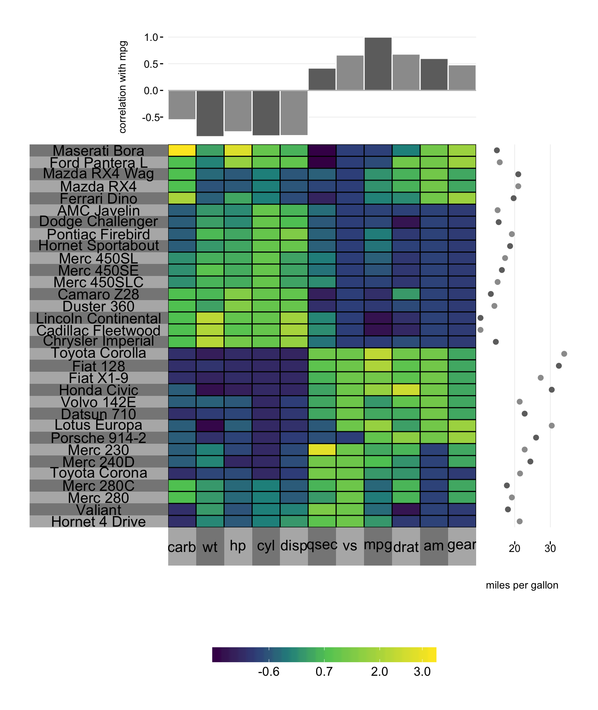

# superheat: An R package for supervised heatmaps


[](https://travis-ci.org/rlbarter/superheat)

*Superheat* is an R package for generating beautiful and customizable heatmaps. **See the [vignette](https://rlbarter.github.io/superheat/) for usage**.

If you find any bugs, have any feature requests or feedback, please submit an issue.


To download and install the development version of the package, use `devtools`:

```{r, eval = FALSE}
install.packages("devtools")
devtools::install_github("rlbarter/superheat")
```

Once you've installed the package, you can load the library in the standard way:

```{r}
library(superheat)
```


Basic usage:

```{r, fig.height = 9.5, fig.width = 8, fig.align = "center"}
superheat(mtcars,
          # normalize variables
          scale = T,
          # order rows/cols based on heirarchical clustering
          pretty.order.rows = TRUE,
          pretty.order.cols = TRUE,
          # plot miles per gallon next to the rows
          yr = mtcars$mpg,
          yr.axis.name = "miles per gallon",
          # plot correlation with mpg above columns
          yt = cor(mtcars)[, "mpg"],
          yt.plot.type = "bar",
          yt.axis.name = "correlation with mpg",
          # increase size of left labels
          left.label.size = 0.45)
```


